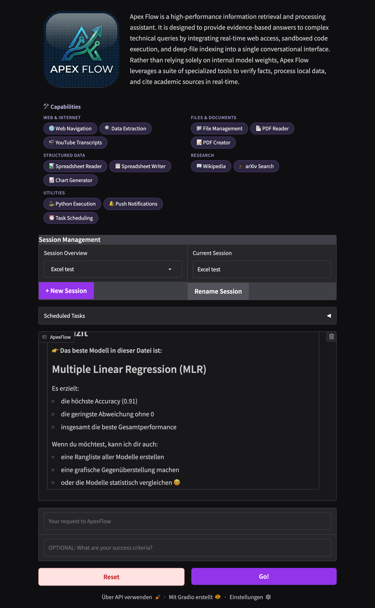

# ApexFlow — AI Research & Task Automation Assistant

ApexFlow is an autonomous AI agent with a conversational interface. Describe what you need and, optionally, define what success looks like — ApexFlow plans, uses tools, self-evaluates, and keeps working until the job is done.

It maintains persistent memory across sessions: it remembers facts about you and can resume previous conversations where you left off.

---



---
## What it can do

### Web & Internet
- **Web navigation** — browse URLs, click links, fill forms, take screenshots via a real Chromium browser (Playwright)
- **Web search** — query Google in real-time via Serper for up-to-date results
- **Data extraction** — pull text and hyperlinks from any web page

### Research
- **Wikipedia** — look up general knowledge topics
- **arXiv** — search and retrieve academic papers by topic, author, or keyword
- **YouTube transcripts** — fetch and analyse transcripts from any YouTube video

### Files & Documents
- **File management** — read, write, move, copy, delete, and list files inside the sandbox directory
- **PDF reader** — extract and analyse text from PDF files (page-by-page extraction)
- **PDF creator** — generate properly formatted PDF files with Unicode font support

### Structured Data
- **Spreadsheet reader** — read CSV and Excel (.xlsx) files from the sandbox; returns column names, row count, and a data preview
- **Spreadsheet writer** — create CSV or Excel files in the sandbox from structured data (headers + rows)
- **Chart generator** — produce PNG bar, line, pie, or scatter charts from any dataset via matplotlib

### Knowledge Base (RAG)
- **Semantic search** — search your own indexed documents (PDFs, text files, markdown, CSV) using natural language queries
- **Document indexing** — upload or drop files into `sandbox/knowledge/` and index them with one click; documents are chunked and embedded via OpenAI
- **Index management** — add, remove, and re-index documents; unchanged files are skipped automatically
- **Grounded answers** — the agent retrieves relevant chunks from your documents to answer questions with source citations

### Code & Computation
- **Python execution** — run sandboxed Python code for calculations, data processing, or scripting

### Task Scheduling
- **Schedule tasks** — set up recurring background jobs with cron expressions (e.g. "check the news every morning at 8 AM")
- **List & cancel tasks** — view all scheduled tasks with their status and last results, or cancel them by ID
- **Push notification integration** — optionally get notified via Pushover when a scheduled task produces results

### Notifications
- **Push notifications** — send alerts to your phone via Pushover when a long-running task completes

### Memory & Context
- **User profile** — automatically learns and remembers facts about you (name, location, preferences, technical level, etc.) across sessions
- **Session history** — each conversation is stored in SQLite and can be resumed at any time

---

## How it works

ApexFlow uses a **worker–evaluator loop** built on [LangGraph](https://github.com/langchain-ai/langgraph):

```
User input (task + success criteria)
        |
    +--------+
    | WORKER |  <--------------------------+
    +---+----+                            |
        | tool calls?                     |
      yes |           no                  |
    +-----+-----+   +-----------+         |
    |   TOOLS   |   | EVALUATOR |         |
    +-----+-----+   +-----+-----+         |
          |               |               |
          +---------------+               |
                    met? |                |
                  yes /   \ no            |
                  END       +-------------+
```

1. The **worker** (GPT-5.2) receives your task, any success criteria, user profile context, and a set of tools it can use.
2. If a tool is needed (browser, search, code execution, etc.), it runs and control returns to the worker.
3. Once the worker produces a response, the **evaluator** (GPT-5.2) checks it against your success criteria using structured output.
4. If the criteria are not met, the evaluator feeds back and the worker tries again.
5. The loop ends when the task is complete or the agent needs your input.

### Persistent memory

- **Session history** — each conversation is stored in SQLite and can be resumed at any time.
- **User profile** — facts learned about you (name, location, occupation, interests, preferred language, output format, technical level, etc.) are extracted automatically via LLM and injected into future sessions so ApexFlow always has context.
- **Checkpoints** — LangGraph state is checkpointed to SQLite, enabling mid-conversation recovery.

---

## Setup

### Prerequisites

- Python 3.12+
- [uv](https://github.com/astral-sh/uv) package manager
- A Chromium-compatible browser (installed automatically by Playwright)

### Install dependencies

```bash
uv sync
playwright install chromium
```

### Configure API keys

Create a `.env` file in the project root:

```env
# Required — LLM provider
OPENAI_API_KEY=your_openai_api_key

# Web search (required for Google search tool)
SERPER_API_KEY=your_serper_api_key

# Push notifications (optional)
PUSHOVER_USER=your_pushover_user_key
PUSHOVER_TOKEN=your_pushover_app_token

# Observability (optional)
LANGSMITH_TRACING=true
LANGSMITH_API_KEY=your_langsmith_api_key
LANGSMITH_PROJECT=apexflow
LANGSMITH_ENDPOINT=https://eu.api.smith.langchain.com
```

Only `OPENAI_API_KEY` is required to run the core agent. Other keys unlock specific tools.

### Run the app

```bash
uv run app.py
```

The Gradio UI opens in your browser automatically. Stop with `Ctrl+C`.

---

## Testing

### Install test dependencies

Test dependencies are part of the `dev` group and are included with:

```bash
uv sync --dev
```

### Run the tests

```bash
# Run all tests
uv run pytest

# Verbose output with short tracebacks
uv run pytest -v --tb=short

# Run a specific test class
uv run pytest tests/test_tools_unit.py::TestCreatePdf -v

# Run a specific test
uv run pytest tests/test_tools_unit.py::TestGetYoutubeTranscript::test_joins_transcript_lines -v
```

### Coverage report

```bash
# Terminal summary (shows uncovered lines)
uv run pytest --cov --cov-report=term-missing

# HTML report (open htmlcov/index.html in a browser)
uv run pytest --cov --cov-report=html
```

---

## Usage

1. Open the browser UI (launches at `http://localhost:7860` by default).
2. Select an existing session from the dropdown or create a new one with **+ New Session**.
3. Optionally rename the session to something meaningful.
4. Type your task in the **message** field.
5. Optionally describe your **success criteria** — what does "done" look like?
6. Click **Go!** and watch ApexFlow work, including live tool call feedback in the chat.
7. Use **Reset** to clear the current session's in-progress context.

---

## Project structure

```
AI-Assistant/
├── app.py               # Gradio web UI and application entry point
├── sidekick.py          # Core agent: worker, evaluator, LangGraph state machine
├── sidekick_tools.py    # Tool integrations (browser, search, files, code, notifications)
├── knowledge.py         # Knowledge base: document chunking, embedding, ChromaDB vector search
├── scheduler.py         # Task scheduling: SQLite-backed cron tasks with APScheduler
├── session_manager.py   # SQLite-backed session creation, listing, and renaming
├── user_profile.py      # Persistent key-value store for user facts
├── readdb.py            # Database inspection utility (development tool)
├── pyproject.toml       # Project metadata and dependencies
├── .env                 # API keys and configuration (not committed)
├── sandbox/             # Working directory for agent file operations
│   └── knowledge/       # Drop documents here for knowledge base indexing
└── tests/
    ├── conftest.py      # Shared fixtures (mock LLMs, sandbox, sample PDF)
    └── test_tools_unit.py  # Unit tests for all tools in sidekick_tools.py
```

### Key files

| File | Role |
|---|---|
| [app.py](app.py) | Launches the Gradio interface, wires UI events, manages the agent lifecycle |
| [sidekick.py](sidekick.py) | Defines the `Sidekick` class, LangGraph state machine (3-node graph), worker and evaluator nodes, user profile extraction, and persistent memory |
| [sidekick_tools.py](sidekick_tools.py) | Registers all tools: Playwright browser automation, Google Serper search, file I/O (sandbox), Python REPL, Wikipedia, arXiv, YouTube transcripts, PDF read/create, Pushover notifications, CSV/Excel read/write, PNG chart generation, task scheduling, knowledge base search |
| [knowledge.py](knowledge.py) | Document chunking, OpenAI embedding, ChromaDB vector storage, semantic search over local files |
| [scheduler.py](scheduler.py) | SQLite-backed task scheduling with cron expressions; persists tasks, validates cron, tracks results |
| [session_manager.py](session_manager.py) | Creates, lists, and renames named sessions backed by SQLite |
| [user_profile.py](user_profile.py) | Stores and retrieves persistent facts about the user across sessions |
| [readdb.py](readdb.py) | Reads and displays contents of the chat history and checkpoint databases (for debugging) |

---

## Tech stack

| Layer | Technology |
|---|---|
| LLM | OpenAI GPT-5.2 (worker + evaluator) |
| Agent orchestration | [LangGraph](https://github.com/langchain-ai/langgraph) with SQLite checkpointing |
| Browser automation | [Playwright](https://playwright.dev/) via LangChain toolkit |
| UI | [Gradio](https://www.gradio.app/) |
| Search | Google Serper, Wikipedia, arXiv |
| Document processing | pypdf (reading), fpdf2 (creation) |
| Structured data | openpyxl (Excel), csv (CSV), matplotlib (charts) |
| Knowledge base / RAG | [ChromaDB](https://www.trychroma.com/) (vector store), OpenAI embeddings, langchain-text-splitters |
| Media | youtube-transcript-api |
| Task scheduling | [APScheduler](https://apscheduler.readthedocs.io/) with SQLite persistence |
| Notifications | [Pushover](https://pushover.net/) |
| Persistence | SQLite (sessions, chat history, user profile, checkpoints) |
| Code execution | LangChain PythonREPLTool (sandboxed) |
| Observability | LangSmith |
| Package management | [uv](https://github.com/astral-sh/uv) |

---

## License

MIT — see [LICENSE](LICENSE).
